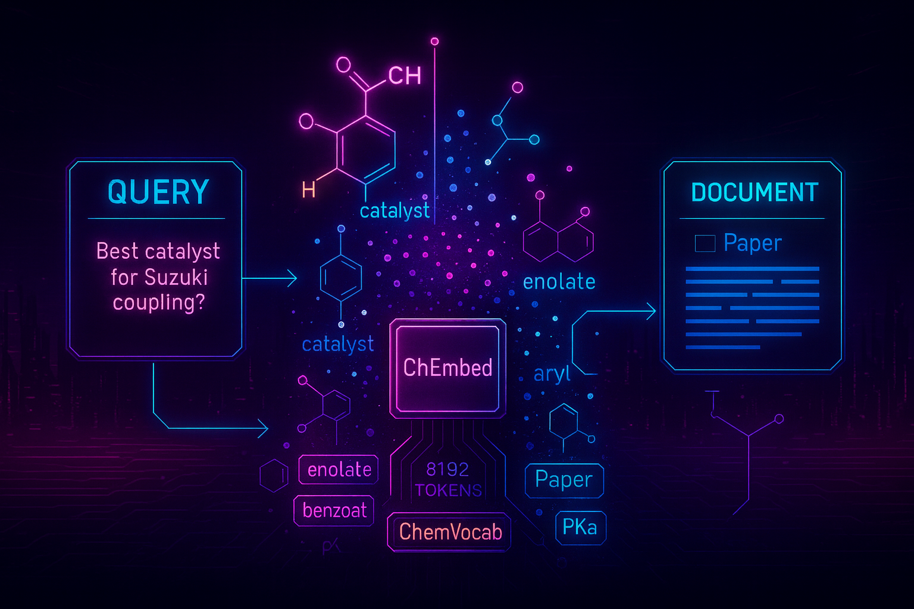

## ChEmbed: Domain-Adaptive Text Embeddings for Scientific Literature



This repository adapts and extends the upstream [nomic-ai/contrastors](https://github.com/nomic-ai/contrastors) to finetune and pretrain Nomic text embedding models on chemistry-specific scientific corpora. The resulting models are named **ChEmbed** and are optimized for chemical literature retrieval and related tasks.

- Upstream codebase: [nomic-ai/contrastors](https://github.com/nomic-ai/contrastors)
- Chemistry data curation and pair mining repo: [HSILA/Chemistry-Data](https://github.com/HSILA/Chemistry-Data)
- Chemistry datasets collection (query–passage pairs): [Chemical Data](https://huggingface.co/collections/BASF-AI/chemical-data-685b21fedf9026ead61b9f24)
- Trained ChEmbed models: [ChEmbed](https://huggingface.co/collections/BASF-AI/chembed-685b3e809ac7d2963544865a)
- Paper: ChEmbed: Enhancing Chemical Literature Search Through Domain-Specific Text Embeddings ([arXiv:2508.01643](https://www.arxiv.org/abs/2508.01643))

The training was executed on Compute Canada (Narval) using 4× A100 GPUs.

---

## Features

- Built on [FlashAttention](https://github.com/Dao-AILab/flash-attention) for efficient training
- Multi-GPU support (PyTorch Distributed / Deepspeed)
- [GradCache](https://github.com/luyug/GradCache) for large batches
- Hugging Face Transformers integration (BERT-style encoders)
- CLIP-style contrastive objectives with paired and triplet data

---

## Quick start (standard, with internet)

1) Create and activate a virtualenv

```bash
python3 -m venv .venv
source .venv/bin/activate
```

2) Install core build tools and dependencies

```bash
pip install wheel packaging ninja setuptools torch
pip install -r requirements.txt
pip install -e .
```

3) Install FlashAttention from source if your environment requires it; refer to `wheels/README.md` for more details.

---

## Training on Compute Canada (offline-friendly)

Use the provided batch script `training-script.sh`, which sets up the environment and launches training:

```bash
sbatch training-script.sh
```

What it does:
- Loads site modules (CUDA 12.2, GCC 12.3, Python 3.10, etc.)
- Configures offline caches for Hugging Face (`HF_HUB_OFFLINE=1`, `HF_DATASETS_OFFLINE=1`)
- Creates a venv on `$SLURM_TMPDIR`
- Installs wheels from the local `wheels/` directory (see `wheels/README.md`) and `requirements-cc.txt`
- Launches training with 4 GPUs via `torchrun`


If you do not have access to the internet, you can build the environment manually:
- Place all required wheels under `wheels/` and follow `wheels/README.md` for downloading the correct dependencies.
- Point `setup.py` to use `requirements-cc.txt` instead of `requirements.txt` when installing on Narval.

```4:6:setup.py
with open("requirements.txt") as f:
    requirements = f.read().splitlines()
```

Change `requirements.txt` to `requirements-cc.txt` if you want to default to the Compute Canada set when running `pip install -e .` in an offline context.

---

## Data loading: local folders and S3

We rewrote the dataloader to support both local file paths and S3-compatible endpoints. Dataset configurations live in:
- `src/contrastors/configs/data/chem_finetune_pairs.yaml`
- `src/contrastors/configs/data/chem_finetune_triplets.yaml`

You can use absolute local paths (e.g., `/path/.../shard-{00000..00004}.jsonl.gz`) or S3 URIs (with proper `fsspec` configuration). See the YAMLs above for concrete examples.

---

## Training configs

- Finetune (starting from `nomic-ai/nomic-embed-text-v1`): `src/contrastors/configs/train/chem_contrastive_finetune.yaml`
- Pretrain (starting from `nomic-ai/nomic-embed-text-v1-unsupervised`): `src/contrastors/configs/train/chem_contrastive_pretrain.yaml`

Example commands (from `src/contrastors`):

```bash
torchrun --nproc-per-node=4 train.py \
  --config=configs/train/chem_contrastive_finetune.yaml \
  --dtype=bf16
```

```bash
torchrun --nproc-per-node=4 train.py \
  --config=configs/train/chem_contrastive_pretrain.yaml \
  --dtype=bf16
```

Key fields in `model_args` within these configs:
- `model_name`: base checkpoint (finetune: `nomic-ai/nomic-embed-text-v1`, pretrain: `nomic-ai/nomic-embed-text-v1-unsupervised`)
- `tokenizer_name`: `bert-base-uncased` or the chemistry-adapted `BASF-AI/ChemVocab`
- `trainable_params`: controls which parameters update (see below)

---

## Tokenizer adaptation (BASF-AI/ChemVocab)

To better represent chemical entities (e.g., IUPAC names), we adapted the tokenizer by inserting chemistry-specific tokens into previously unused slots and released it as `BASF-AI/ChemVocab`. In the paper, we describe adding roughly 900 specialized tokens and maintaining long-context support, which improves retrieval over general-purpose tokenizers. See the paper for details: [arXiv:2508.01643](https://www.arxiv.org/abs/2508.01643).

Training schemes used with the adapted tokenizer:
- Vanilla: use the original tokenizer and finetune as usual.
- Full: switch to `BASF-AI/ChemVocab` and train the entire model end-to-end.
- Plug: switch to `BASF-AI/ChemVocab` and only learn the newly added “unused” token embeddings, keeping the rest fixed.
- Progressive: stage-wise training; start with only the new token embeddings, then open up the rest of the model (and finally everything) for stable adaptation.

How to set via `model_args.trainable_params`:
- `all`: train everything (use for Full; final stage of Progressive; also Vanilla when keeping the original tokenizer)
- `unused_only`: freeze the whole model except the word-embedding matrix; within the embedding layer, only gradients for previously unused token IDs are kept. Use for Plug; stage 1 of Progressive
- `unused_and_rest`: train the whole model but freeze gradients for special tokens and already-used tokens in the embedding layer; the rest of the model updates normally. Useful as stage 2 in Progressive

You can switch schemes by editing `model_args.tokenizer_name` and `model_args.trainable_params` in the YAML configs.

---

## Data sources, artifacts, and models

- Chemistry data collection and pair mining code: [HSILA/Chemistry-Data](https://github.com/HSILA/Chemistry-Data)
- Curated datasets (pairs/triplets): [Chemical Data](https://huggingface.co/collections/BASF-AI/chemical-data-685b21fedf9026ead61b9f24)
- Trained ChEmbed models: [ChEmbed](https://huggingface.co/collections/BASF-AI/chembed-685b3e809ac7d2963544865a)

---

## License

This code is licensed under the [Apache 2.0 License](LICENSE). See model cards for individual model licenses.

## Acknowledgements

We extend thanks to the authors and maintainers of [nomic-ai/contrastors](https://github.com/nomic-ai/contrastors), FlashAttention, GradCache, and the HuggingFace ecosystem.
Additionally, we would like to thank the BASF and Digital Research Alliance of Canada for providing the computing resources for this project.

---

## Citation

If you find ChEmbed or this codebase useful, please cite:

```bibtex
@misc{kasmaee2025chembed,
  title        = {ChEmbed: Enhancing Chemical Literature Search Through Domain-Specific Text Embeddings},
  author       = {Ali Shiraee Kasmaee and Mohammad Khodadad and Mahdi Astaraki and Mohammad Arshi Saloot and Nicholas Sherck and Hamidreza Mahyar and Soheila Samiee},
  year         = {2025},
  eprint       = {2508.01643},
  archivePrefix= {arXiv},
  primaryClass = {cs.IR},
  doi          = {10.48550/arXiv.2508.01643},
  url          = {https://www.arxiv.org/abs/2508.01643}
}
```

You may also find the upstream Nomic Embed papers helpful:

```bibtex
@misc{nussbaum2024nomic,
  title        = {Nomic Embed: Training a Reproducible Long Context Text Embedder},
  author       = {Zach Nussbaum and John X. Morris and Brandon Duderstadt and Andriy Mulyar},
  year         = {2024},
  eprint       = {2402.01613},
  archivePrefix= {arXiv},
  primaryClass = {cs.CL}
}
@misc{nussbaum2024nomicembedvisionexpanding,
  title        = {Nomic Embed Vision: Expanding the Latent Space},
  author       = {Zach Nussbaum and Brandon Duderstadt and Andriy Mulyar},
  year         = {2024},
  eprint       = {2406.18587},
  archivePrefix= {arXiv},
  primaryClass = {cs.CV},
  url          = {https://arxiv.org/abs/2406.18587}
}
```
